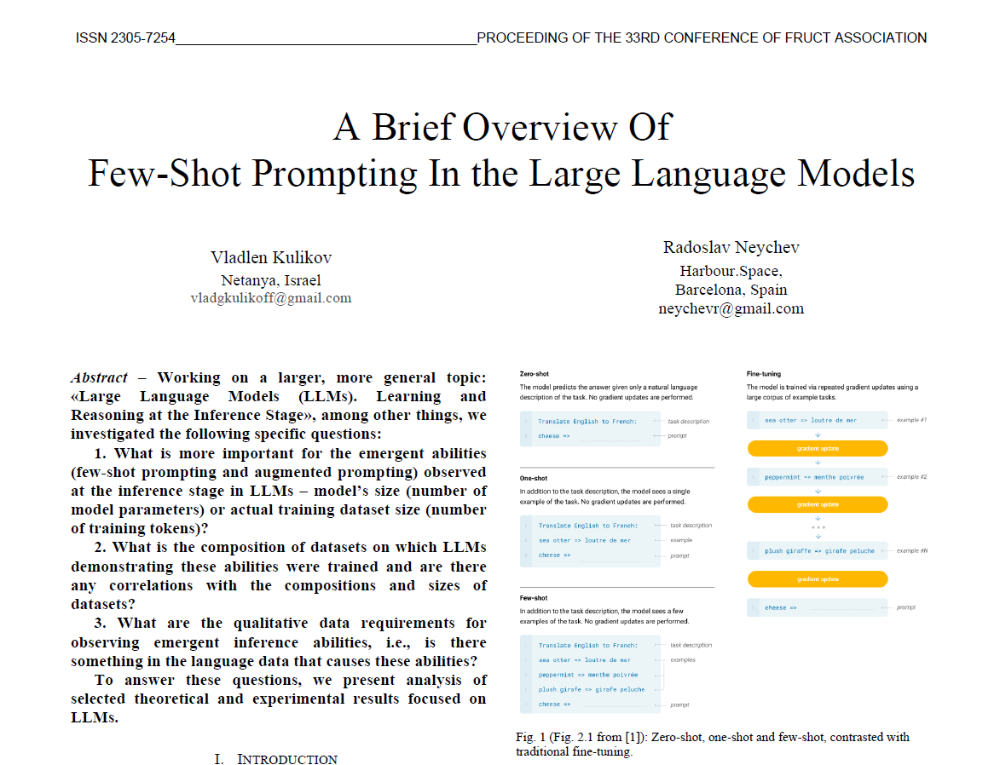

# My 2023 article: ***A Brief Overview Of Few-Shot Prompting In the Large Language Models***

  

---

## III. CONCLUSION

As a result of this analysis, two potential areas of possible further in-depth research were identified:  

a) The influence of the composition of the language dataset on the occurrence and effectiveness of emergent abilities in LLMs (the available evidence does not allow unambiguous conclusions, while only to compile a series of observations, point 4 in this section).

b) Determination of the lower bound on the number of training tokens required for observation of emergent abilities in LLMs at the inference stage (point 5 in this section).

**This analysis also allows us to make the following conclusions and observations:**

1. Learning from data comparable in complexity to languages is a critical moment for the appearance of emergent abilities in LLMs in the inference stage.  
2. The size of LLMs, namely, the number of the parameters, is more important than the number of training tokens on which LLMs were trained, which is observed both with the same (and different) datasets in general composition.  
3. Generally, model size should be greater than 40-50B for stable few-shot and augmented prompt effect, with high accuracy.  
However, in certain types of tasks this behavior can be observed from 7-13B sized models.  
As the number of parameters of the same model increases, and all other things being equal, LLMs become able to solve problems in inference (for few-shot, augmented prompt tasks) that they could not handle with a smaller model size.  
4. In general, the question of the influence of the composition of the language dataset on the manifestation of emergent abilities remains open. We have not observed unequivocal evidence, and the need for more in-depth research is clear, but although individual comments can be made:
GPT-3 – the model most often showing the best results (for few-shot and augmented prompting), trained on a large body of unlabeled text LaMDA – initially dialogue-oriented and therefore has a
specific dataset composition, as well as GPT-3, it often shows good results for augmented prompting abilities.  
5. Obviously, there is a lower bound on the required number of training tokens for observing emergence, and this bound should be, among other things, a function of the number of model parameters, but this issue requires a separate detailed study. Rough estimate of the average value ~ 300B training tokens for models in the parameter range from 175 to 530 B.